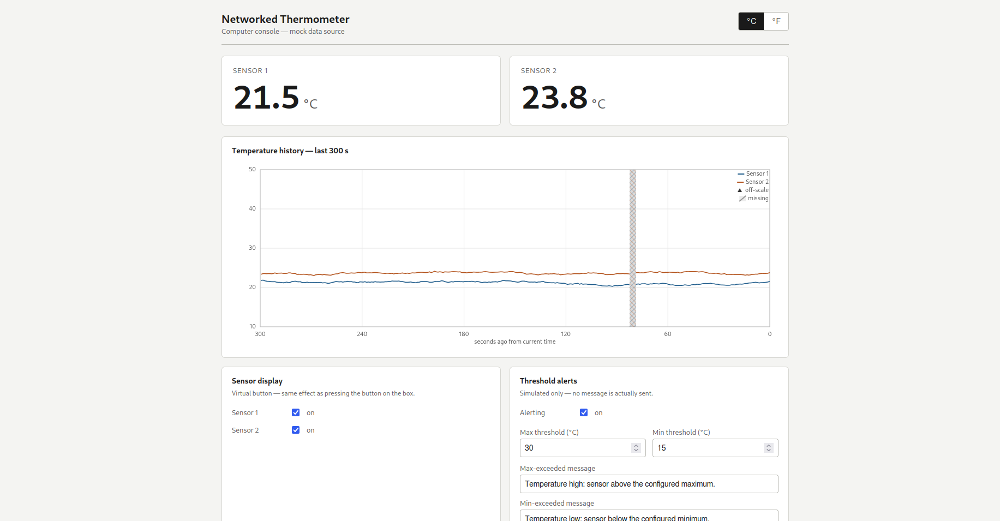

# Networked Thermometer — Computer Console

The **computer** component of the ECE:4880 dual-sensor networked thermometer
system.

> ⚠️ **This app currently runs on MOCK DATA only.**
> The "third box" hardware (two temperature sensors, buttons, display, power
> switch) is being built in parallel and does not exist yet. This console talks
> to a simulator that produces realistic data and can be scripted to reproduce
> every edge case in the spec. Everything the app needs from the real hardware
> is defined by one small interface — see
> [Connecting to the real hardware](#connecting-to-the-real-hardware).

---

## Screenshots



*Main console: large real-time readouts for both sensors, the fixed-scale
chart recorder (the hatched band is a simulated data outage), sensor display
toggles, and the threshold-alert configuration.*

<!-- Add more screenshots here as you capture them, e.g.:


-->

---

## Running it

**Prerequisites:** Node.js 20+ and npm (developed on Node 24).

```bash
npm install
npm run dev
```

Open the URL Vite prints — default <http://localhost:5173>. The chart is
pre-seeded with 300 s of history, so it's full immediately. Hot-reloads on
save; `Ctrl+C` stops it.

| Command | Purpose |
| --- | --- |
| `npm run dev` | Run the console in development |
| `npm test` | Unit tests: alert logic, readout logic, mock data source, an App render smoke test (13 tests) |
| `npm run build` | Type-check + production build into `dist/` |
| `npm run preview` | Serve the production build locally |
| `npm run lint` | oxlint |

No cloud services, API keys, or internet access are required for the default
console (mock data + logged SMS).

## Running with SMS alerts

`npm run dev` starts the web app **and** a small delivery service
(`server/`, on `127.0.0.1:8787`). The browser evaluates alerts against the
mock sensor data as usual and POSTs each HIGH/LOW transition to the service.

Delivery mode is set by `server/.env` (copy from `server/.env.example`):

| `SMS_MODE` | Behaviour | Needs |
| --- | --- | --- |
| `console` (default) | Logs the message to the server console. Nothing is sent. | nothing |
| `test` | Calls the Twilio API with **test credentials** and [magic numbers](https://www.twilio.com/docs/iam/test-credentials). Exercises the real request path without sending or charging. | Twilio test SID/token; `TWILIO_FROM_NUMBER=+15005550006` |
| `live` | Sends a real SMS. | Twilio live SID/token, an SMS-capable Twilio number, and (on a trial account) a verified destination number |

Set the destination phone number in the app's **Threshold alerts** panel
(E.164 format, e.g. `+15551234567`). The default destination is already a
valid dummy E.164 number. To test end to end in `console` mode:
open the app, use the **Demo controls** to pin a sensor above 50 °C, and
watch the **api** terminal for a line like
`Text message sent to +15555550123: "Temperature high: …"` and the app's Alert
activity panel for the delivery badge.

If `ALERT_API_TOKEN` is set in `server/.env`, also set
`VITE_ALERT_API_TOKEN` (same value) in a root `.env` file so the frontend
can authenticate.

---

## What it does (mapped to the lab spec)

**Real-time display**
- Both sensors, independently, large font, updates once per second.
- °C / °F toggle in the header (affects readouts *and* the chart, live, without
  resetting history).
- `unplugged sensor` message when a sensor is disconnected.
- `no data available` for both sensors when the third box's switch is off.
- Live numbers resume automatically the moment data returns — no refresh.

**Virtual sensor control**
- A toggle per sensor turns its display on/off from the computer — the software
  equivalent of the physical button on the box. Takes effect in well under 1 s.

**Chart recorder (last 300 s)**
- New point on the right, scrolls right-to-left, oldest falls off the left.
- Y-axis is **fixed** at 10–50 °C (50–122 °F) and never auto-scales.
- X-axis is labelled "seconds ago from current time", 300 → 0.
- History seeds on startup (well within the spec's 10 s).

**Missing vs. off-scale data** — deliberately distinct:
- **Missing** (switch off / unplugged / display off): a hatched band in the
  sensor's colour, labelled "no data". The chart keeps scrolling through it.
- **Off-scale** (a real reading above 50 °C or below 10 °C): a solid triangle
  clipped to the top or bottom rail. The numeric readout still shows the true
  value with an "off chart scale" note.

**Threshold alerts**
- Configure max threshold, min threshold, an independent custom message for
  each, and an E.164 destination phone number.
- Crossing a threshold logs a `SIMULATED ALERT` entry and POSTs the event to
  the local delivery service (see
  [Running with SMS alerts](#running-with-sms-alerts)). In the default
  `console` mode the service logs the SMS and does not send anything.
- Fires **once per crossing**, not every second. Re-arms only after the reading
  returns inside the band.

**Demo controls** (bottom panel, mock data only)
- Flip the third-box power switch on/off.
- Unplug / re-plug each sensor.
- Spike a sensor to 60 °C or drop it to 0 °C (off-scale), then resume.
- Reset everything.

These are how you demonstrate spec compliance without hardware. They disappear
automatically once a real data source is connected.

---

## Architecture: the data-source seam

Everything the UI knows about the hardware goes through **one interface**,
`ThermometerSource`, defined in
[`src/datasource/types.ts`](src/datasource/types.ts). The UI, hooks, and
business logic depend only on that interface — never on the mock.

```
                    ┌───────────────────────────────┐
   React UI  ─────▶  │  ThermometerSource (interface) │
   hooks / lib       └───────────────┬───────────────┘
                                     │  one of:
                     ┌───────────────┴────────────────┐
                     ▼                                ▼
        MockThermometerSource            RealThermometerSource
        (simulator, ships today)         (talks to the third box — TODO)
```

The active source is chosen in **one line** in
[`src/datasource/index.ts`](src/datasource/index.ts).

```
src/
  datasource/
    types.ts                  the hardware contract — READ THIS FIRST
    mockThermometerSource.ts   the simulator
    index.ts                   exports the active source (the swap point)
  hooks/useThermometer.ts      subscribes, keeps the rolling 300 s window
  lib/
    temperature.ts             C/F conversion, the fixed 10–50 scale
    readout.ts                 what the big number shows
    alerts.ts                  pure threshold evaluation, once-per-crossing
  components/                  RealtimeReadout, ChartRecorder, SensorControls,
                               AlertSettings, AlertLog, DebugPanel
  App.tsx
```

### The data contract

At roughly 1 Hz the source produces a `ThermometerFrame`:

```ts
interface ThermometerFrame {
  timestamp: number;                 // epoch milliseconds
  switchState: 'on' | 'off';         // third-box power switch
  readings: Record<1 | 2, {
    sensorId: 1 | 2;
    celsius: number | null;          // null when there is NO reading
    connected: boolean;              // sensor physically plugged in
    enabled: boolean;                // sensor display on (button state)
  }>;
}
```

`celsius` must be `null` — not `0`, not a stale value — whenever the box cannot
produce a fresh reading: switch off, sensor unplugged, or sensor display turned
off. Send raw Celsius; the app handles unit conversion and clamping.

Interface methods:

| Method | Purpose |
| --- | --- |
| `getFrame()` | latest frame, for first render |
| `getSwitchState()` | convenience accessor |
| `setSensorEnabled(id, bool)` | the virtual button; must appear in the stream within 1 s |
| `subscribe(fn)` | ~1 Hz stream of frames; returns an unsubscribe function |
| `getHistory(seconds)` | backlog to seed the chart on startup (may return `[]`) |
| `start()` / `stop()` | begin / end the stream |

---

## Connecting to the real hardware

This is the plan for wiring the console to the actual third box, the sensor
probes, and the phone. **None of it changes the UI** — it is all one new file
plus firmware work.

### 1. Physical piece → what it maps to

| Real thing | Interface element | What has to be built |
| --- | --- | --- |
| Third-box microcontroller | the transport (below) | firmware that emits a JSON frame ~1 Hz |
| Power switch | `frame.switchState` | firmware reports `'off'`, **or** the console infers "off" from loss of signal (see step 4) |
| Sensor probe 1 / 2 | `readings[n].celsius` | ADC / 1-Wire read, converted to °C, sent raw |
| Probe unplugged | `readings[n].connected = false`, `celsius = null` | firmware detects an open circuit / out-of-range read on that channel |
| Physical display button | `readings[n].enabled` | firmware toggles a per-sensor flag and reports it |
| Console's on/off toggle | `setSensorEnabled(id, bool)` | firmware accepts a command message and applies it to the same flag |
| The phone | the alert log → real SMS/email | a small backend + a provider account (see below) |

### 2. Choose a transport (box ↔ computer)

Pick based on what the box's microcontroller can do:

| Transport | Good when | `RealThermometerSource` uses |
| --- | --- | --- |
| **WebSocket** (box runs a WS server, e.g. on an ESP32) | box has Wi-Fi; want true 1 Hz push and a return channel for the virtual button | `new WebSocket('ws://<box-ip>:81')` |
| **HTTP polling** | simplest firmware; box exposes `GET /reading` and `POST /command` | `fetch` on a 1 s interval |
| **MQTT over WebSocket** | box is battery-powered / behind NAT; a broker sits in between | an MQTT-WS client, subscribe to `box/frame`, publish to `box/command` |
| **USB serial** (box plugged into the computer) | no networking on the box | the Web Serial API (`navigator.serial`, Chrome only), or a tiny local bridge that re-exposes serial as a WebSocket |

WebSocket is the recommended target: it matches the 1 Hz streaming model and
gives a built-in path for `setSensorEnabled` commands.

### 3. Define the on-the-wire JSON

Have the firmware emit exactly the `ThermometerFrame` shape so the adapter is
nearly a pass-through:

```json
{
  "timestamp": 1717000000000,
  "switchState": "on",
  "readings": {
    "1": { "sensorId": 1, "celsius": 22.4, "connected": true,  "enabled": true },
    "2": { "sensorId": 2, "celsius": null, "connected": false, "enabled": true }
  }
}
```

If the box's native format differs, the translation lives in one place — the
adapter's message handler — and nothing else needs to know.

### 4. Implement `RealThermometerSource`

One new file, `src/datasource/realThermometerSource.ts`, implementing
`ThermometerSource`. Skeleton:

```ts
import type { ThermometerFrame, ThermometerSource, SensorId } from './types';

export class RealThermometerSource implements ThermometerSource {
  private ws: WebSocket | null = null;
  private last: ThermometerFrame = OFFLINE_FRAME;          // switchState: 'off'
  private history: ThermometerFrame[] = [];
  private listeners = new Set<(f: ThermometerFrame) => void>();
  private staleTimer: ReturnType<typeof setTimeout> | null = null;

  constructor(private url: string) {}

  start() {
    this.ws = new WebSocket(this.url);
    this.ws.onmessage = (e) => {
      const frame = JSON.parse(e.data) as ThermometerFrame; // validate here
      this.ingest(frame);
    };
    this.ws.onclose = () => {
      this.scheduleReconnect();       // exponential backoff
      this.markOffline();             // synthesize switchState:'off' frames
    };
  }

  stop() { this.ws?.close(); this.ws = null; }

  private ingest(frame: ThermometerFrame) {
    this.last = frame;
    this.history.push(frame);
    this.trimHistory(frame.timestamp);           // keep ~360 s
    this.resetStaleWatchdog();                    // 3 s → markOffline()
    for (const l of this.listeners) l(frame);
  }

  getFrame() { return this.last; }
  getSwitchState() { return this.last.switchState; }
  getHistory(seconds: number) {
    const cutoff = Date.now() - seconds * 1000;
    return this.history.filter((f) => f.timestamp >= cutoff);
  }
  subscribe(fn: (f: ThermometerFrame) => void) {
    this.listeners.add(fn);
    return () => this.listeners.delete(fn);
  }
  setSensorEnabled(sensorId: SensorId, enabled: boolean) {
    this.ws?.send(JSON.stringify({ type: 'setEnabled', sensorId, enabled }));
    // Optionally update this.last optimistically so the UI reacts < 1 s.
  }
}
```

Then change the one line in `src/datasource/index.ts`:

```ts
export const thermometerSource: ThermometerSource =
  new RealThermometerSource('ws://third-box.local:81');
```

Nothing in `src/components`, `src/hooks`, or `src/lib` changes. The demo-control
panel hides itself because `RealThermometerSource` does not implement the
optional `ThermometerSimControls`.

### 5. Two things the adapter must handle that the mock fakes for free

- **"Switch off" as a disconnect.** A truly powered-off box sends nothing, so
  the adapter needs a **staleness watchdog**: if no frame arrives for ~3 s,
  synthesize frames with `switchState: 'off'` so the console shows
  "no data available" and the chart gaps. When frames resume, real data flows
  again — this is what satisfies the spec's "recover within 10 s" requirement.
  (If the box has a *soft* switch that keeps the radio alive, it can just report
  `switchState: 'off'` directly and the watchdog is a backup.)
- **Clock skew.** The chart's X-axis uses frame timestamps. If the box clock is
  unreliable, have the adapter stamp `timestamp = Date.now()` on arrival
  instead of trusting the box.

### 6. Where the app and the box run

The console is a static site. On demo day, run `npm run dev` (or serve
`npm run build` output) on the lab computer, with the box on the **same LAN**.
Note: a browser page served over **https** cannot open an insecure `ws://` — so
either serve the console over plain `http` on the LAN, or terminate `wss://`
with a certificate on the box/broker.

### Phone / email alert delivery

SMS delivery is implemented: see [Running with SMS alerts](#running-with-sms-alerts).
Default `console` mode needs no API keys. Real Twilio send is optional (`SMS_MODE=live`).

Email delivery is still out of scope.

---

## Assumptions / judgement calls (worth confirming with the instructor)

1. **"Display off" (virtual button off)** is shown as its own readout message
   (`display off`) and as a missing-data gap on the chart. The spec names the
   unplugged and switch-off cases explicitly but not this one.
2. **Missing-data bands are per-sensor and full plot height**, tinted in that
   sensor's colour, so a one-sensor outage doesn't look like a total outage.
3. **Alerts + missing data:** a sensor that goes offline while exceeding a
   threshold and returns still-exceeded does **not** re-alert — missing data is
   not treated as returning to the safe band.
4. **Thresholds are stored in Celsius** and converted for display; editing in
   °F round-trips through Celsius (minor display rounding).
5. **Alert destination** is a free-text field with no validation; nothing is
   sent in this MVP.
6. **Tooling:** added `vitest` + `jsdom` as dev dependencies for the test suite
   (the original brief suggested a plain React app).

---

## Stack

Vite + React + TypeScript. The chart recorder is drawn by hand on a `<canvas>`
(no charting library) so the fixed axis, right-to-left scroll, and the
missing-vs-off-scale rendering behave exactly as the spec requires.
